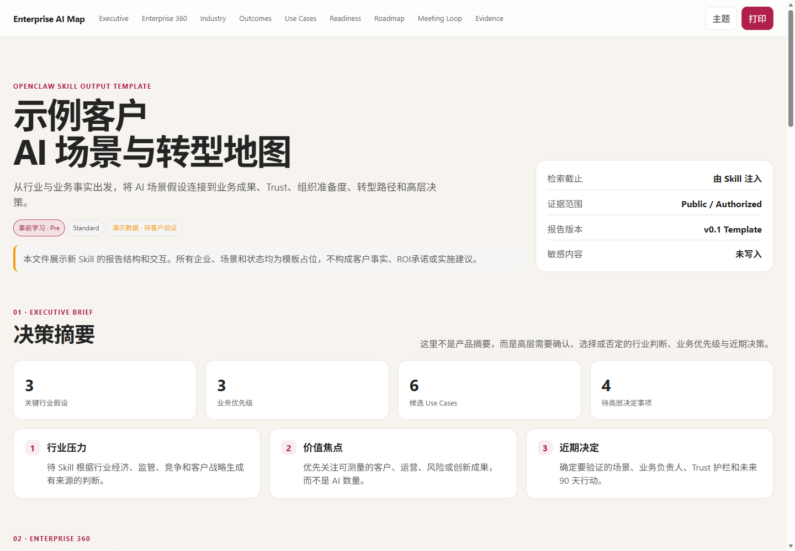

# Enterprise AI Use Case Map

为任意企业构建证据化的 Enterprise AI Scenario & Transformation Map，支持事前学习、事中讨论、事后跟进和持续刷新，主产物为可交互、自包含的 HTML 报告。



## 主要功能

- 企业实体消歧与公开资料深度调研。
- 行业经济、价值链、监管和企业差异化分析。
- 将行业信号转化为业务优先级与 Outcome Tree。
- 从 Top-down、Bottom-up、Outside-in 三条路径发现 AI Use Cases。
- 按价值、可测量性、准备度、Trust、组织变更和证据置信度形成场景组合。
- 将场景分类为 `Scale Now`、`Prove Next`、`Enable First`、`Hold/Stop`。
- 支持 `pre`、`during`、`post`、`refresh` 四种客户会谈阶段。
- 输出具备导航、搜索、筛选、场景详情、深浅主题和打印视图的单文件 HTML。

## 安装

克隆仓库后，将本文件夹复制到 OpenClaw 的本地 Skill 目录：

```text
~/.scout/m-skills/enterprise-ai-use-case-map/
```

目录至少需要保留：

```text
enterprise-ai-use-case-map/
├── SKILL.md
├── README.md
├── THIRD_PARTY_NOTICES.md
├── assets/
└── examples/
```

## 使用方式

```text
/enterprise-ai-use-case-map <企业名称> [国家/区域] [模式] [深度]
```

示例：

```text
/enterprise-ai-use-case-map GSK 中国 pre standard
/enterprise-ai-use-case-map Siemens Germany pre deep
/enterprise-ai-use-case-map Contoso China post standard
```

如果只提供企业名称，默认使用：

```text
pre + standard
```

## 模式

| 模式 | 用途 | 重点产物 |
| --- | --- | --- |
| `pre` | 事前学习 | 客户 360、行业假设、候选场景、问题地图 |
| `during` | 事中讨论 | Confirmed / Rejected / Unknown、基线、责任人和决策 |
| `post` | 事后跟进 | 优先组合、决策记录、90 天行动 |
| `refresh` | 持续刷新 | Added / Changed / Confirmed / Rejected / Retired |

深度可选 `quick`、`standard` 或 `deep`。

## HTML 报告结构

1. Executive Brief
2. Enterprise 360
3. Industry & Value Chain
4. Outcome Tree
5. Use Case Portfolio
6. Readiness & Trust
7. Transformation Roadmap
8. Meeting Loop
9. Evidence & Gaps

通用效果示例位于：

```text
examples/enterprise-ai-use-case-map-demo.html
```

## 设计原则

- 公开事实、客户确认、分析假设和未知项必须分层。
- 不虚构企业流程、数据、ROI 或收益。
- 仅凭公开资料生成的是场景假设，不是项目批准建议。
- 高风险场景必须明确人类责任、停止条件和 Trust 要求。
- 没有客户基线与负责人时，不得把场景放入 `Scale Now`。
- 报告默认不依赖外部网络资源，可离线打开。

## 来源说明

该 Skill 参考了开源项目 `MetaInFLow/Enterprise-ai-scenario-map-skill` 的研究工作流思想。详见 [THIRD_PARTY_NOTICES.md](THIRD_PARTY_NOTICES.md)。
